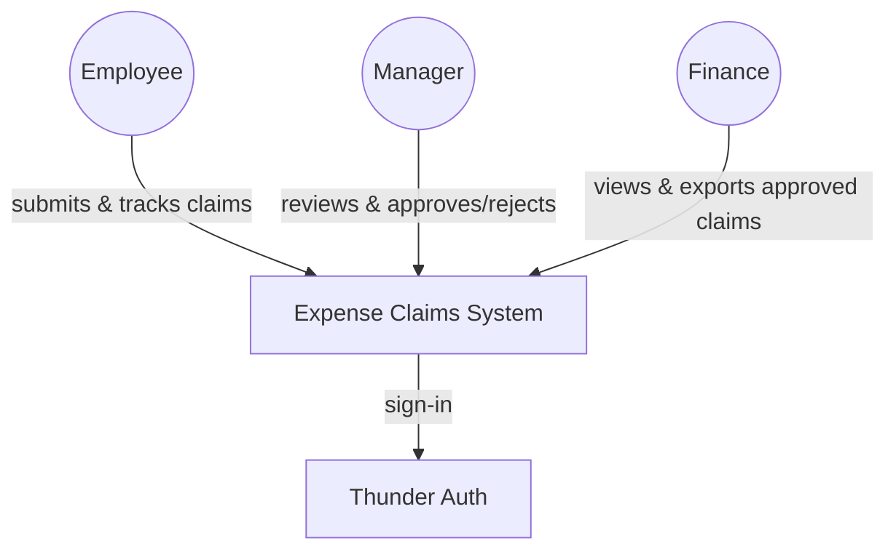
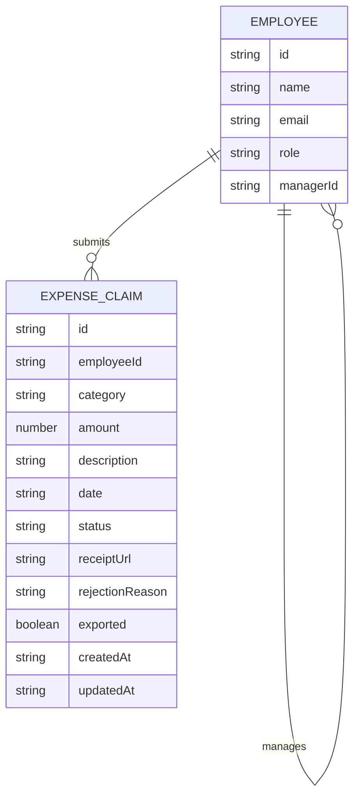
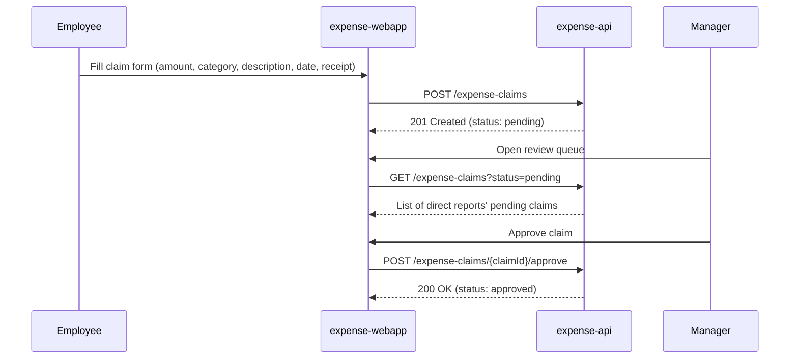
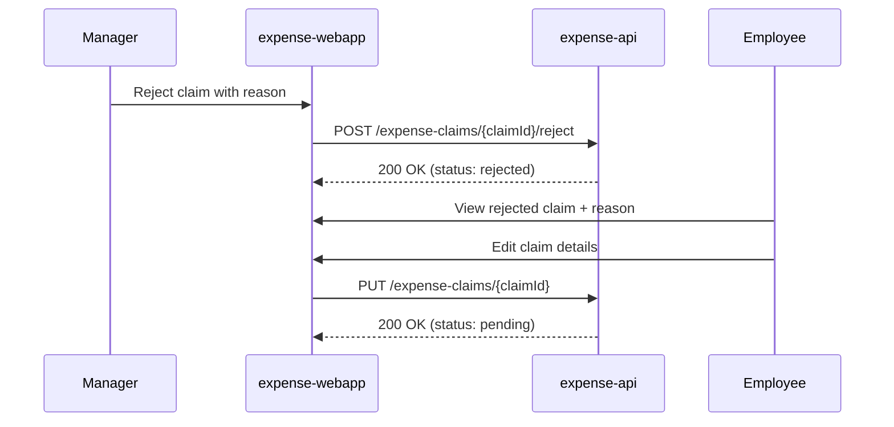
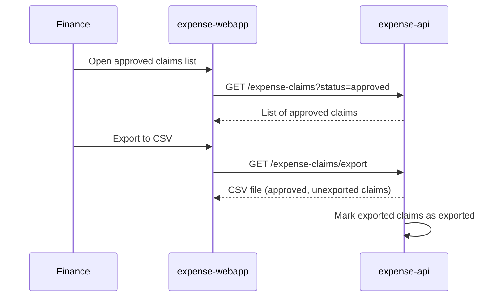

# Expense Claims — Design

Employees submit expense claims through a single-page web app; managers review and approve or reject their direct reports' claims; finance exports the approved claims to a CSV file for the payroll run. All claim state and business logic live in one Ballerina service backed by a database; sign-in for all three actors runs through Thunder SSO.

## Context (C1)

## Domain model (ER)

`EMPLOYEE.role` is one of `employee`, `manager`, `finance` (a manager is also an employee who can submit their own claims). `EXPENSE_CLAIM.status` is one of `pending`, `approved`, `rejected`. `category` is one of the fixed list: Travel, Meals, Lodging, Office Supplies, Other.

## Key flows

### Submit and approve

### Reject and resubmit

### Finance export

